# 📊 API Flow — BookingKhachSan

> **Kiến trúc**: Clean Architecture (4 layers)
> **Pattern**: CQRS + MediatR + Repository

---

## 🏗️ Tổng quan kiến trúc

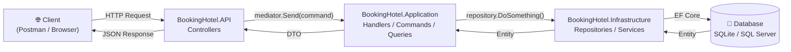

---

## 1️⃣ API Quản lý Hotel

### `GET /api/hotels` — Danh sách + Tìm kiếm & Lọc

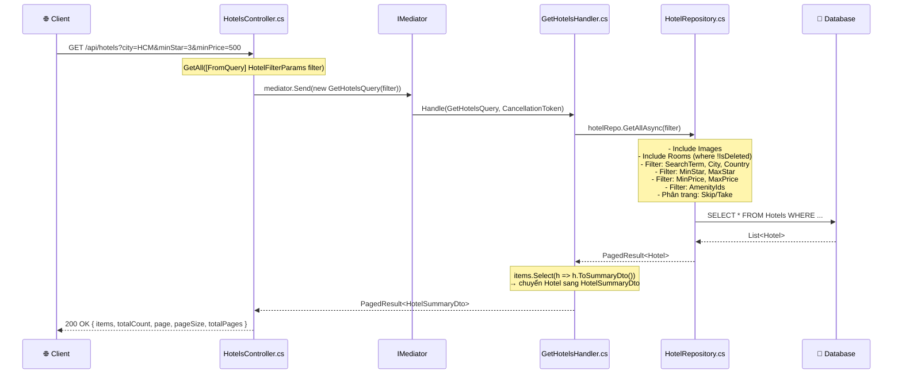

### `GET /api/hotels/{id}` — Chi tiết Hotel

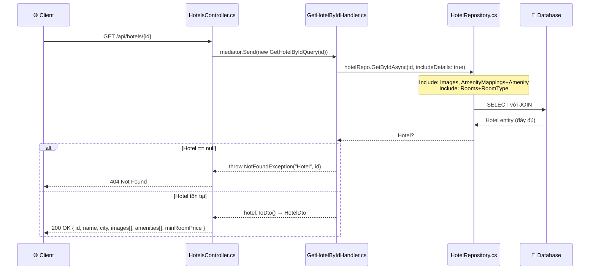

### `POST /api/hotels` — Tạo Hotel

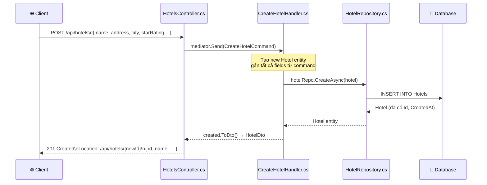

### `PUT /api/hotels/{id}` — Cập nhật Hotel

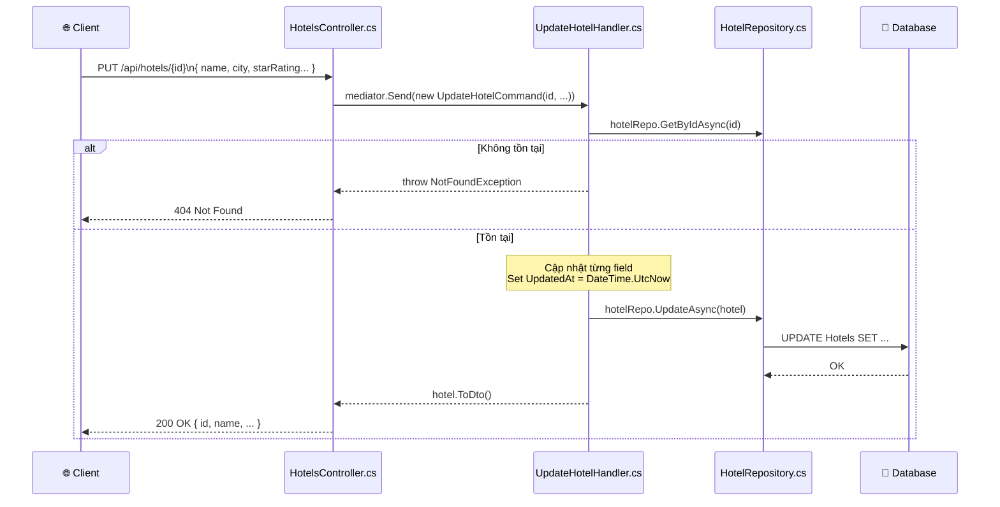

### `DELETE /api/hotels/{id}` — Xóa mềm Hotel

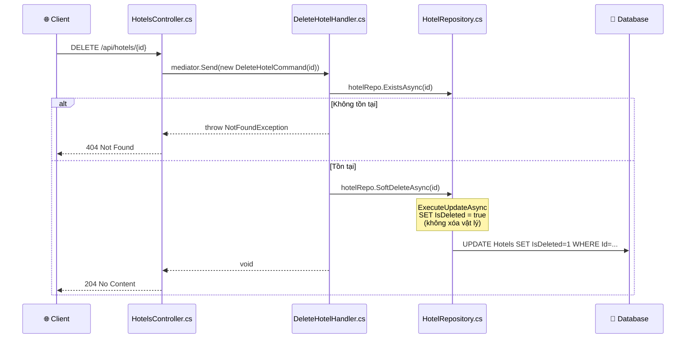

### `POST/DELETE /api/hotels/{id}/amenities/{amenityId}` — Gắn / Gỡ Tiện ích

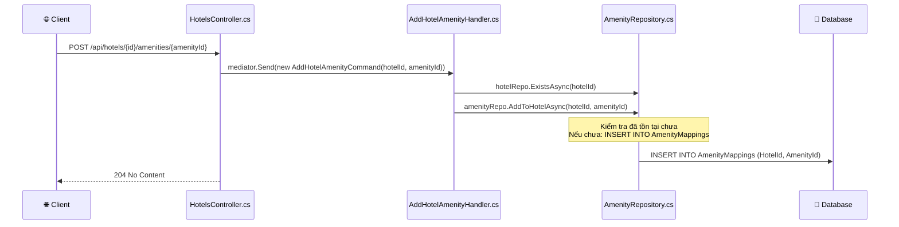

---

## 2️⃣ API Quản lý Room

### `GET /api/hotels/{hotelId}/rooms` — Danh sách phòng

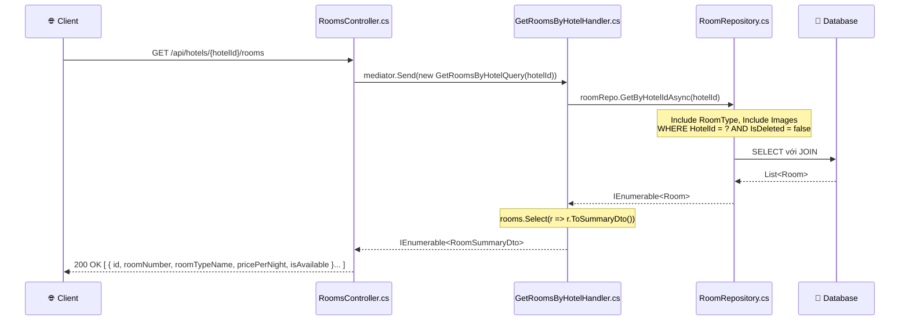

### `POST /api/hotels/{hotelId}/rooms` — Tạo phòng mới

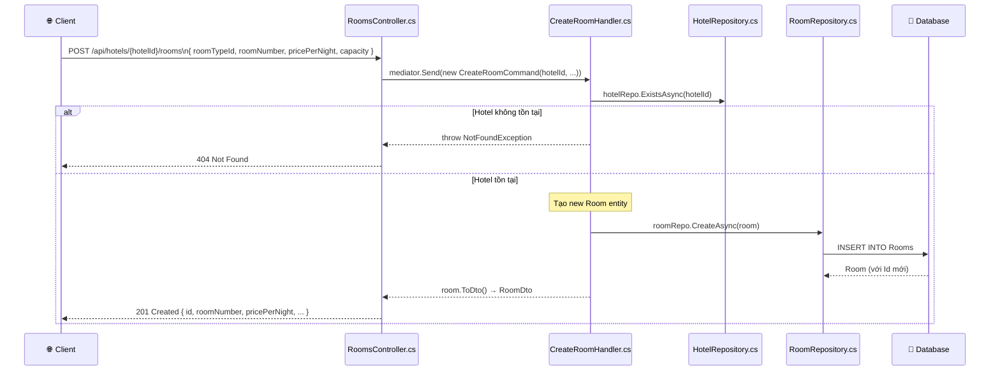

---

## 3️⃣ API Quản lý RoomType

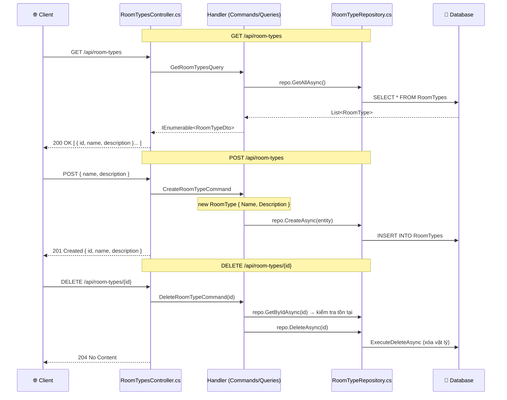

---

## 4️⃣ API Quản lý Amenity (Tiện ích)

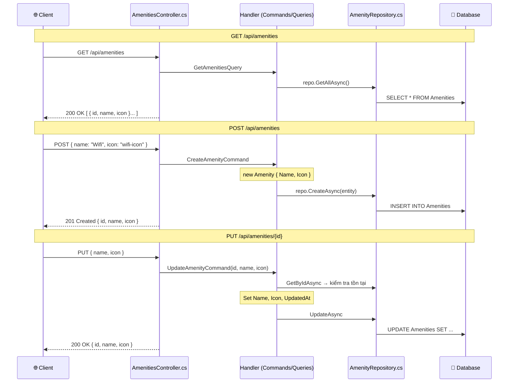

---

## 5️⃣ API Upload ảnh (Cloudinary)

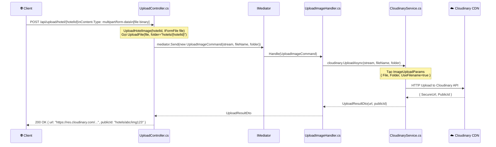

---

## 📋 Bảng tóm tắt tất cả Endpoints

| Method | Endpoint | Controller | Handler | Repository | Return |
|--------|----------|------------|---------|------------|--------|
| GET | `/api/hotels` | HotelsController | GetHotelsHandler | HotelRepository | `PagedResult<HotelSummaryDto>` |
| GET | `/api/hotels/{id}` | HotelsController | GetHotelByIdHandler | HotelRepository | `HotelDto` |
| POST | `/api/hotels` | HotelsController | CreateHotelHandler | HotelRepository | `HotelDto` (201) |
| PUT | `/api/hotels/{id}` | HotelsController | UpdateHotelHandler | HotelRepository | `HotelDto` |
| DELETE | `/api/hotels/{id}` | HotelsController | DeleteHotelHandler | HotelRepository | `204 NoContent` |
| POST | `/api/hotels/{id}/amenities/{aid}` | HotelsController | AddHotelAmenityHandler | Amenity+HotelRepo | `204 NoContent` |
| DELETE | `/api/hotels/{id}/amenities/{aid}` | HotelsController | RemoveHotelAmenityHandler | Amenity+HotelRepo | `204 NoContent` |
| GET | `/api/hotels/{hotelId}/rooms` | RoomsController | GetRoomsByHotelHandler | RoomRepository | `IEnumerable<RoomSummaryDto>` |
| GET | `/api/hotels/{hotelId}/rooms/{id}` | RoomsController | GetRoomByIdHandler | RoomRepository | `RoomDto` |
| POST | `/api/hotels/{hotelId}/rooms` | RoomsController | CreateRoomHandler | Room+HotelRepo | `RoomDto` (201) |
| PUT | `/api/hotels/{hotelId}/rooms/{id}` | RoomsController | UpdateRoomHandler | RoomRepository | `RoomDto` |
| DELETE | `/api/hotels/{hotelId}/rooms/{id}` | RoomsController | DeleteRoomHandler | RoomRepository | `204 NoContent` |
| GET | `/api/room-types` | RoomTypesController | GetRoomTypesHandler | RoomTypeRepository | `IEnumerable<RoomTypeDto>` |
| GET | `/api/room-types/{id}` | RoomTypesController | GetRoomTypeByIdHandler | RoomTypeRepository | `RoomTypeDto` |
| POST | `/api/room-types` | RoomTypesController | CreateRoomTypeHandler | RoomTypeRepository | `RoomTypeDto` (201) |
| PUT | `/api/room-types/{id}` | RoomTypesController | UpdateRoomTypeHandler | RoomTypeRepository | `RoomTypeDto` |
| DELETE | `/api/room-types/{id}` | RoomTypesController | DeleteRoomTypeHandler | RoomTypeRepository | `204 NoContent` |
| GET | `/api/amenities` | AmenitiesController | GetAmenitiesHandler | AmenityRepository | `IEnumerable<AmenityDto>` |
| GET | `/api/amenities/{id}` | AmenitiesController | GetAmenityByIdHandler | AmenityRepository | `AmenityDto` |
| POST | `/api/amenities` | AmenitiesController | CreateAmenityHandler | AmenityRepository | `AmenityDto` (201) |
| PUT | `/api/amenities/{id}` | AmenitiesController | UpdateAmenityHandler | AmenityRepository | `AmenityDto` |
| DELETE | `/api/amenities/{id}` | AmenitiesController | DeleteAmenityHandler | AmenityRepository | `204 NoContent` |
| POST | `/api/upload/hotel/{hotelId}` | UploadController | UploadImageHandler | CloudinaryService | `UploadResultDto` |
| POST | `/api/upload/room/{roomId}` | UploadController | UploadImageHandler | CloudinaryService | `UploadResultDto` |

---

## 🔁 Flow chung (áp dụng cho tất cả API)

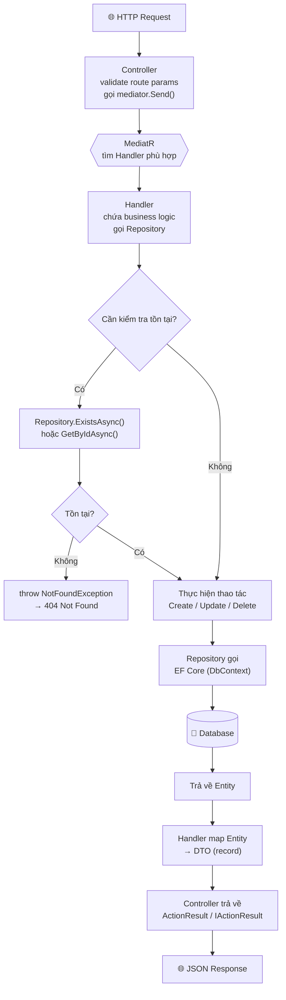

---

> **Ghi chú thiết kế:**
> - **Soft Delete**: Hotel và Room không xóa vật lý, chỉ set `IsDeleted = true`. EF Core `HasQueryFilter` tự động lọc.
> - **NotFoundException**: Được throw từ Handler, sẽ được xử lý bởi `ExceptionMiddleware` để trả về 404.
> - **CQRS**: Commands (thay đổi dữ liệu) và Queries (đọc dữ liệu) tách biệt hoàn toàn.
> - **Nested Route**: Room nằm dưới Hotel (`/api/hotels/{hotelId}/rooms`) để thể hiện quan hệ sở hữu.
